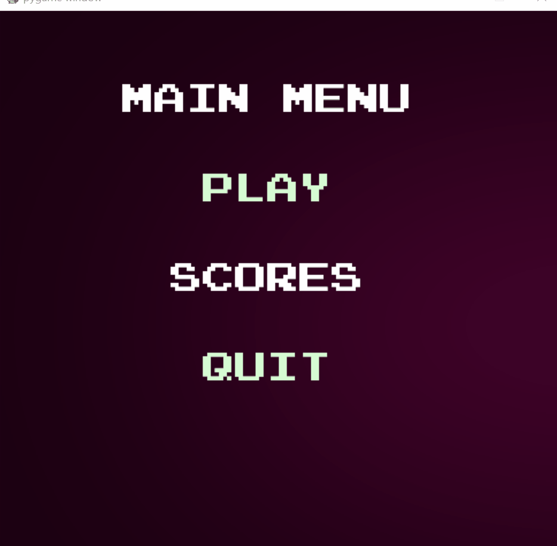
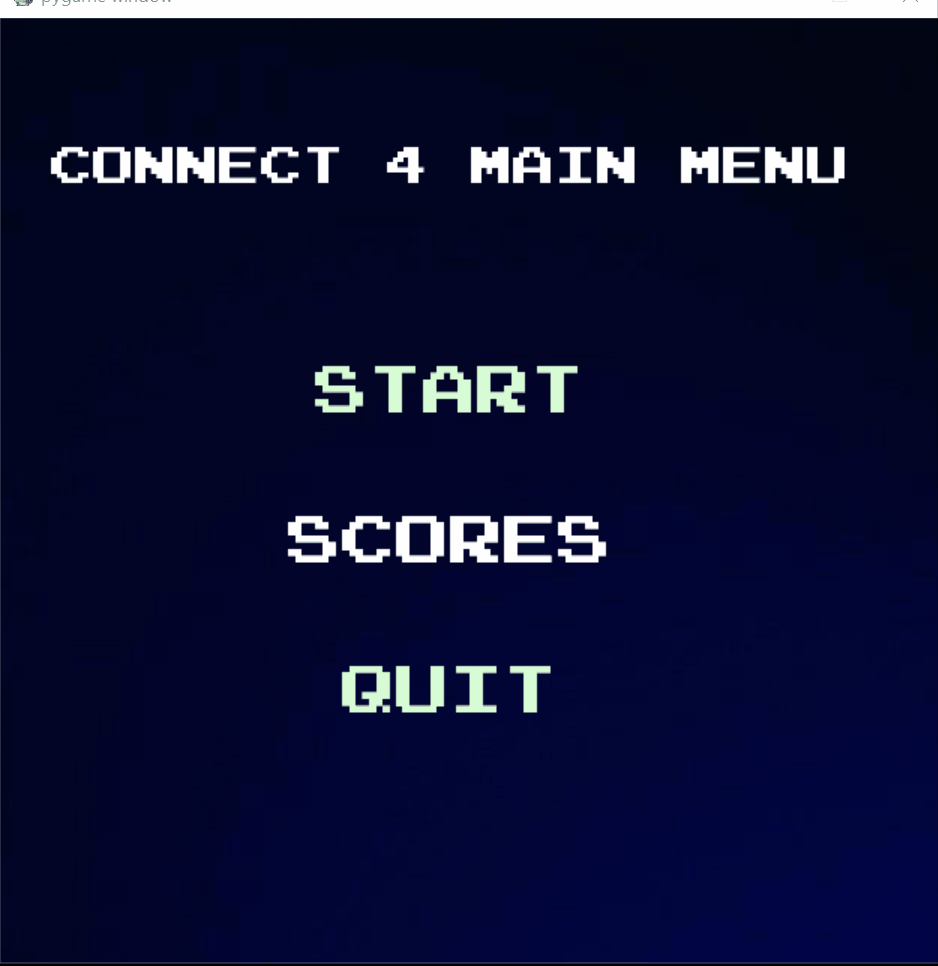

###########################################################################

CPSC 481 class project -  connect 4 with AI

Contributors: 
Roberto Guerra - Designed UI and game logic 
Dung Tran - Assisted with code 
Roya Zeinali - Assisted with UI development and Final report 

###########################################################################  

Main Menu:   you can choose to play (takes you to options, (choose difficulty to play), look at scores,  
(keeps track of scores for each difficulty level, but reset once program is quit), or quit  

Options Menu: Here you can choose to play music(lags a bit) and difficulty  
(once you choose difficulty game starts) and a back button to go back to options. 

## Old GUI&emsp;&emsp;&emsp;&emsp;&emsp;&emsp;&emsp;&emsp;&emsp;Updated GUI

 

We started with the code for connect 4 without AI to familiarize ourselves with the code and functionality. 
Here are the additions we made for our project:
 - added contributed color scheme (CSUF) colors
 - added 12 random AI quotes as player made a move 
 - added a Menu and sub menus
 - added 7 different music titles
 - added 2 game over sound effects and sound effect when making a selection
 - background images for menus  

###########################################################################

References and credit:

pygame documentation:  https://www.pygame.org/docs/

This project was built on code base from Keith Galli which can be found in the following two links:
Video walkthrough on programming this game: https://youtu.be/UYgyRArKDEs

with the AI: https://youtu.be/MMLtza3CZFM
---------------------
We also watched Sergey Zakuraev implementation which can be found here:
https://github.com/zakuraevs/connect4-ai/blob/master/connect4_ai_commented.py
