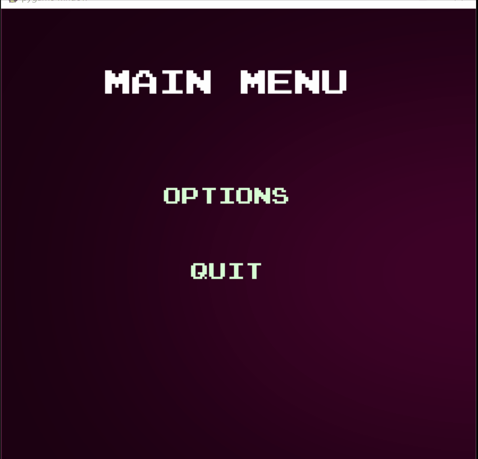

###########################################################################

CPSC 481 class project -  connect 4 with AI

Roberto Guerra 
Dung Tran 
Roya Zeinali 

###########################################################################

## Example Game Play:
#

We started with the code for connect 4 without AI to familiarize ourselves with the code and functionality. 
Here are the additions we made for our project:
 - added contributed color scheme (CSUF) colors
 - added 12 random AI quotes as player made a move 
 - added a Menu and sub menus
 - added 7 different music titles
 - added 2 game over sound effects
 - background image for menu  

###########################################################################

References and credit:

This project was built on code base from Keith Galli which can be found here:

Connect 4 programmed in python using pygame.

Video walkthrough on programming this game: https://youtu.be/UYgyRArKDEs

Video walkthrough on programming the AI: https://youtu.be/MMLtza3CZFM

###########################################################################

We also watched Sergey Zakuraev implementation which can be found here:

https://github.com/zakuraevs/connect4-ai/blob/master/connect4_ai_commented.py

